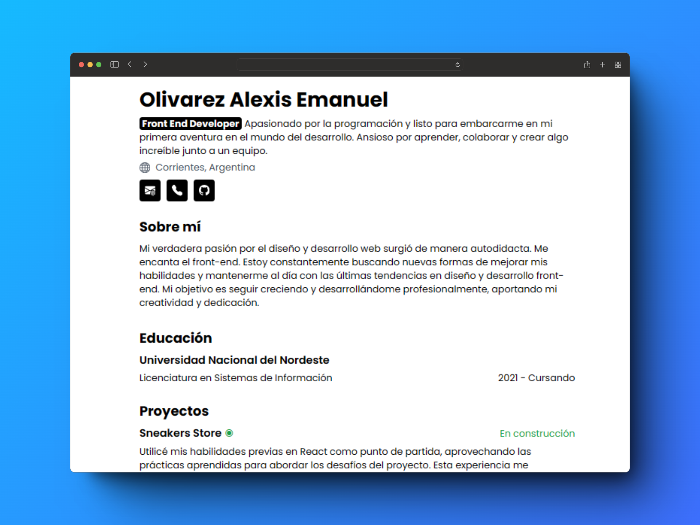

<h2 class='center'>
  <em>Curriculum Vitae</em> minimalista para web y pdf
</h2>

Esquema del JSON del CV de <a href='https://jsonresume.org/schema/'>jsonresume.org</a>

Basado en el diseño de <a href='https://github.com/BartoszJarocki/cv'>Bartosz Jarocki</a>

</img>
